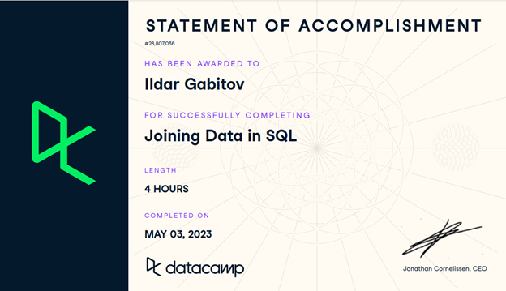

# SQL
Добрый день! Это мое портфолио по SQL. Здесь собраны практические примеры моих работ.

### Быстрые ссылки на проекты:
[ПРОЕКТ №1](/Lesson_1)  
  Краткое описание проекта: 
- Выборка данных с помощью COUNT(), LIMIT;
- Фильтрация с помощью WHERE, BETWEEN, AND, OR, LIKE, NOT LIKE, IN, %, _ , IS NULL, IS NOT NULL;
- ROUND() и агрегатные функции;
- Сортировка и группировка с помощью ORDER BY, DESC, GROUP BY, HAVING
- Операторы сравнения и арифметические операции.

[ПРОЕКТ №2](/SQL_Simulator_Karpov_courses)  
  Краткое описание проекта: 
- Базовые SQL запросы;
- Фильтрация данных;
- Агрегация данных;
- Группировка данных;
- Подзапросы;
- Виды Join-ов.
[Онлайн сертификат на сайте школы Карпова](https://lab.karpov.courses/live_certificate/efae7330-20b7-4032-b403-6907be2fe0e4/)

