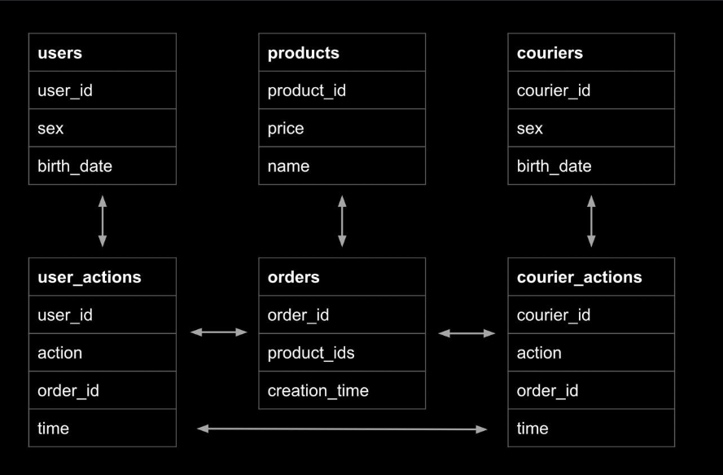
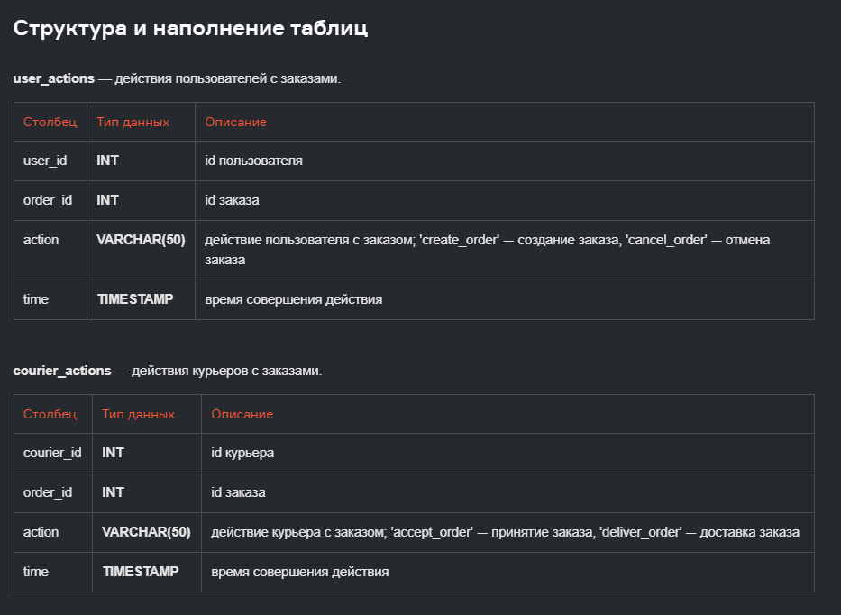
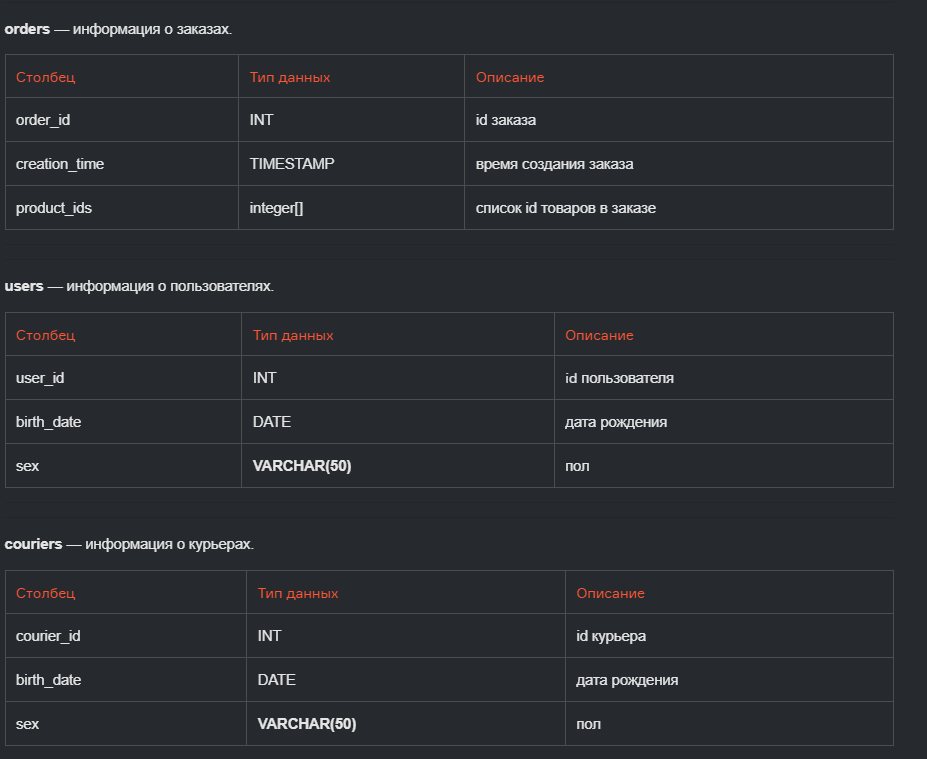
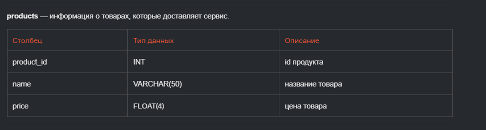

Тут представлены примеры моих SQL запросов из SQL тренажера от школы Карпова.

Запросы SQL разделены на темы:
- [Базовые запросы](1-3_lessons)
- [Фильтрация данных](../4_lesson_data_filtering) 
- [Агрегация данных](../5_lesson_data_aggregation) 
- [Группировка данных](../6_lesson_data_grouping) 
- [Подзапросы](../7_lesson_subqueries) 
- [Виды объединения таблиц](../8_lesson_joins) 

